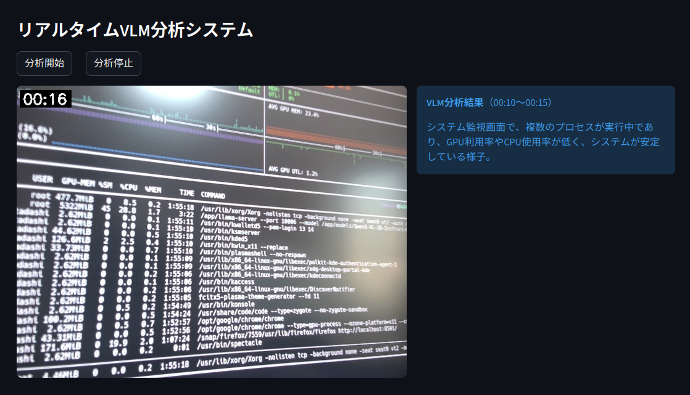

# リアルタイム動画分析サンプル
## 概要
本プロジェクトは、Streamlitを活用したリアルタイム動画分析アプリケーションです。 カメラから取得した映像ストリームから、動画圧縮の要となるキーフレーム（Iフレーム）を効率的に抽出。抽出されたフレームをVLM (Vision Language Model) で解析することで、リアルタイムでの高度な内容理解とGUIへの結果表示を行います。

GUIイメージ:


このプロジェクトの大部分のソースコードはQwen Code CLIとQwen3-Coder-30B-A3B-Instructを用いて作成しています。

## 機能
- カメラからのリアルタイム映像キャプチャ
- 動画セグメントの自動生成
- キーフレームの抽出
- AIによる視覚的認識（VLMクライアント経由）
- 実時間での分析結果表示

## セットアップ

### 必要条件
- Python 3.8以降
- ffmpeg（動画処理に必要）

### ffmpegインストール
```bash
# Ubuntu/Debian
apt install ffmpeg

# macOS
brew install ffmpeg

# Windows (Chocolatey)
choco install ffmpeg
```

### Pythonライブラリインストール
```bash
# 仮想環境の作成
python -m venv .venv

# 仮想環境の有効化
source .venv/bin/activate

# パッケージのインストール
pip install -r requirements.txt
```

## 実行方法
```bash
# 仮想環境の有効化
source .venv/bin/activate

# アプリケーションの実行
streamlit run src/app.py
```

## 設定

`.env`ファイルを使用して、各種設定をカスタマイズできます。以下は利用可能な設定項目の詳細な説明です：

### 動画キャプチャ設定
- `CAMERA_INDEX`: カメラインデックス - 使用するカメラのインデックス番号 (デフォルト: 0)
- `CAPTURE_INTERVAL`: セグメント間隔（秒）- カメラからキャプチャした動画を区切る時間間隔 (デフォルト: 5)
- `TARGET_FPS`: ターゲットFPS - 動画のフレームレート（FPS）(デフォルト: 30.0)

### キーフレーム抽出設定
- `FFMPEG_KEYFRAME_COUNT`: 抽出するキーフレーム数 - 1つの動画セグメントから抽出するキーフレームの数 (デフォルト: 5)

### VLM（視覚言語モデル）設定
- `VLM_MODEL`: 使用するVLMモデル名 - 画像分析に使用するモデルの識別子 (デフォルト: Qwen3-VL-30B-A3B-Instruct-GGUF)
- `VLM_BASE_URL`: VLM APIのベースURL - VLMサービスへの接続先URL（例: http://localhost:22015/v1）(デフォルト: http://localhost:22015/v1)
- `VLM_API_KEY`: VLM APIキー - VLMサービスへの認証に使用するAPIキー (デフォルト: hoge)
- `VLM_IMAGE_MAX_SIZE`: 画像リサイズサイズ - VLMに渡す画像の最大サイズ（幅,高さ）(デフォルト: 800,800)

### プロンプト設定
- `VLM_PROMPT`: VLM分析プロンプト - VLMが動画内容を説明する際の指示文 (デフォルト: 動画の内容を簡潔に200文字以内説明してください。)

## ディレクトリ構成
- `src/` - アプリケーションのソースコード
  - `app.py` - Streamlitアプリケーションのエントリーポイント
  - `config.py` - 設定ファイル
  - `file_manager.py` - ファイル操作関連
  - `keyframe_extractor.py` - キーフレーム抽出機能
  - `queue_manager.py` - 処理キュー管理
  - `video_capture.py` - 動画キャプチャ機能
  - `vlm_client.py` - AI視覚認識クライアント
  - `video_processor.py` - 動画処理クラス